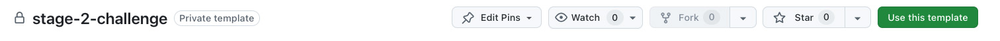

# Stage-2-challenge

Welcome to the Stage 2 Technical Challenge.

This is your opportunity to showcase your skills, creativity, and problem-solving abilities — and to show us that you’re ready to build things for **elephantroom**.

## What we're looking for

We want to see **high-quality code** and clear explainability of your work.  
This challenge is designed to test your **independence**, **ownership**, and **attention to detail**.

No pressure on speed — **time will only be considered** in the event of a close tie with other candidates.

The structure of this test is simple. There are several points, each with a feature to implement. Do not worry if you cannot solve it all.
Upload what you were able to cover. Focus on clean code and on preventing logical bugs. (quality > quantity)
<!-- The structure of this test is simple. There are several points to cover: do as much as you can, but if you can't solve it all, no worries. Upload what you were able to cover. (quality > quantity) -->

## Checklist

- [ ] **Fork** the `stage-2-challenge` repo using the "Use this template" button (top-right).
      
- [ ] **Open Unity Hub** to open **your own** Unity project repo.
  - At the top of the Unity Hub window, go to the Projects tab.
  - Click the "Add" dropdown.
  - Select "Add project".
  - In the file browser, navigate to the folder where you cloned the project.
    Note: Unity version 6000.0.47f1, go to "Scenes" "Basic Room" to upload the room.
- [ ] Work on your solution    
- [ ] Submit a **screen capture video** demonstrating your result.
  - You can include the video file in the repo or share a link to it.
  - No need for voiceover — video-only is perfectly fine.
  - It shouldn't be longer than 3 mins.
- [ ] Invite us ([@2ico](https://github.com/2ico/), [@lorafahmy01](https://github.com/lorafahmy01)) to your repo with the final solution.

## The challenge

### 1. Movement gestures

Your scene contains several objects. Your goal is to make them interactive.

#### 1.1 Dragging objects
- Users should be able to **drag objects around** the room using the mouse.

[`dragging objects - example video`](https://www.youtube.com/watch?v=uYAmGhvl5LI)

#### 1.2 Wall collisions
- During dragging, objects **must not exit** the room boundaries.

[`wall collisions - example video`](https://www.youtube.com/watch?v=iWTF9ILUzuw)

#### 1.3 Rotation on collision
- When objects **collide with a wall**, they should **smoothly rotate to align** with the wall's direction.
- *Note: The HUD visible in the video comes from a different app — it’s not part of this challenge.*

[`rotation on collision - example video`](https://youtu.be/HM-2AKc0ec0)

### 2. Data streaming

To complete the furniture layout, download these GLB models into the scene at runtime using a Unity C# script:

- `https://storage.googleapis.com/furniture-models/armchair/poltrona-biza_a3bc4a40-53e9-4be0-89f1-a7573d600971.glb`
- `https://storage.googleapis.com/furniture-models/dining-chair/victoria-ghost_8d4ea5cc-78a8-4edc-961d-17a3f6e83d4f.glb`

The objects should be placed correctly on the ground, inside the boundaries of the room, and respect the original materials.

We've already included [GLTFast](https://github.com/atteneder/glTFast) in the project for you. Feel free to use another library.

*Note: downloading the model on your computer and importing it the editor doesn't count. You should use the url to import the glb model directly in the Unity scene.*

## Final notes

We're excited to see what you'll build.  

This challenge is not just about getting everything working — it's about **how you think**, **how you solve problems**, and **how you translate that into code**.

Good luck!  
The elephantroom founders
